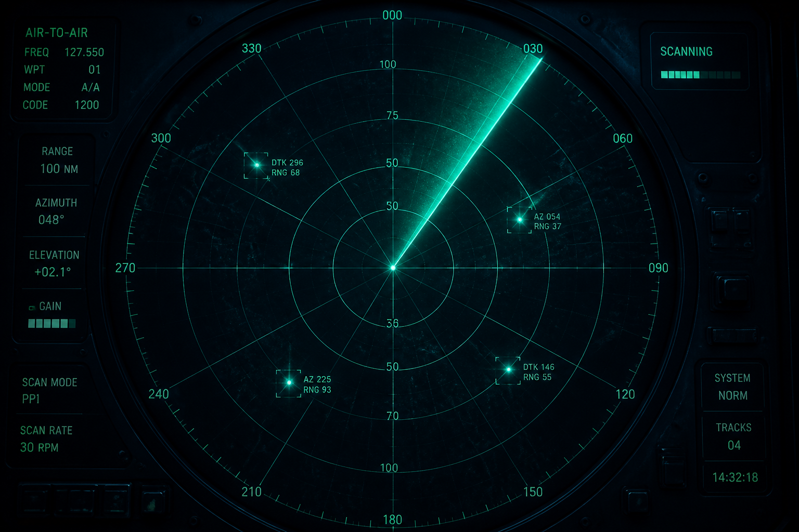
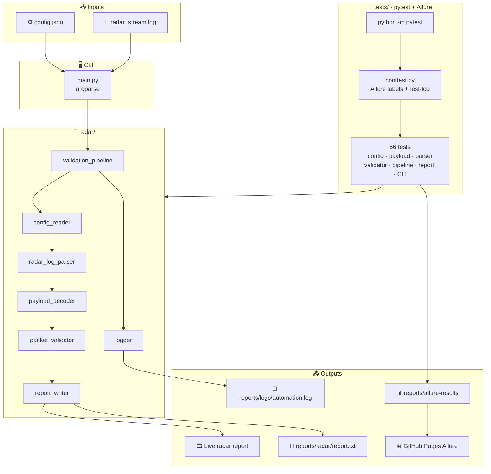
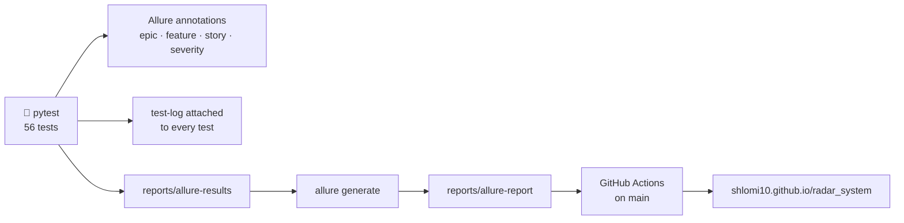
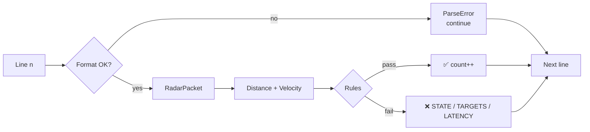

# 📡 Radar Stream Validator

Catch bad radar packets in a live stream — parse, decode, enforce, report.

<p align="center">
  
  
  
  <a href="https://shlomi10.github.io/radar_system/"></a>
</p>
<p align="center">
  
  
  
  
</p>
<p align="center">
  
  
  
  
  
</p>

A CLI automation tool that loads `config.json`, reads a radar hardware log **line by line**, decodes an 8-byte hex `PAYLOAD` (unsigned little-endian Distance + Velocity), and enforces STATE / TARGETS / Latency rules while printing a live summary.

📦 Repo: [github.com/shlomi10/radar_system](https://github.com/shlomi10/radar_system)  
📊 Live Allure: [shlomi10.github.io/radar_system](https://shlomi10.github.io/radar_system/)

---

## 📌 Overview

```text
config.json  +  radar_stream.log  →  parse  →  decode  →  enforce  →  live report
```

What you get:

- 🖥️ CLI validator (`main.py`) — `--config`, `--stream`, `--output`
- 🧩 Modular runtime under `radar/` — **stdlib only**
- 🧪 56 pytest tests with Allure epic / feature / story / severity
- 📝 Logger to `reports/logs/automation.log` — also attached to every Allure test
- 🚀 GitHub Actions → Allure on GitHub Pages + radar report artifact
- 🐳 Optional Docker image — validator + pytest without a local venv

---

## 🏗️ Architecture

Constant-memory pipeline: one previous packet for latency, four integer counters, no `readlines()`, no packet list, no failure list.

Runtime, tests, and Allure all sit on the same `radar/` package:



pytest → Allure → GitHub Pages:



Packet path inside the stream:



---

## 🧱 Project structure

```text
radar-validator/
├── .github/workflows/ci.yml
├── radar/
│   ├── config_reader.py
│   ├── models.py
│   ├── radar_log_parser.py
│   ├── payload_decoder.py
│   ├── packet_validator.py
│   ├── report_writer.py
│   ├── validation_pipeline.py
│   └── logger.py
├── tests/
├── config/config.json
├── data/radar_stream.log
├── assets/radar-banner.png
├── main.py
├── pytest.ini
├── requirements.txt
├── Dockerfile
├── .dockerignore
└── README.md
```

| File | Responsibility |
| --- | --- |
| `radar/config_reader.py` | Load and validate `config.json` |
| `radar/models.py` | Shared data models |
| `radar/radar_log_parser.py` | Line-by-line log parsing |
| `radar/payload_decoder.py` | Unsigned little-endian Distance and Velocity |
| `radar/packet_validator.py` | Enforce STATE, TARGETS, and Latency rules |
| `radar/report_writer.py` | Live report: write each result immediately, keep counters only |
| `radar/validation_pipeline.py` | Constant-memory pipeline: previous packet + counters |
| `radar/logger.py` | File and console logging |
| `main.py` | CLI entry point and runtime arguments |
| `tests/` | pytest + Allure — config, payload, parser, validator, pipeline, report, CLI |
| `.github/workflows/ci.yml` | pytest, Allure, radar report, GitHub Pages |
| `Dockerfile` | Python 3.14-slim image: install deps, run `main.py` by default |
| `.dockerignore` | Keep `.venv`, `.git`, `reports/`, and caches out of the image |

---

## 🛠 Tech stack

| Layer | Tools |
| --- | --- |
| Runtime | Python 3.14+ stdlib (`argparse`, `json`, `pathlib`, `datetime`, `logging`) |
| Tests | pytest · allure-pytest |
| CI | GitHub Actions · GitHub Pages |
| Container | Docker |

---

## 🧾 Logging

```text
reports/logs/automation.log
```

`radar/logger.py` is used by config, payload, parser, validator, pipeline, report, and CLI.

Every pytest test attaches its captured log to Allure as **`test-log`**.

---

## ✅ Prerequisites

- Python 3.14+
- Git
- Docker Desktop (daemon running) only if you want to run the image
- Node.js / npm and Java only if you want to open Allure HTML locally

---

## 📦 Installation

```bash
python -m venv .venv
```

```powershell
.\.venv\Scripts\Activate.ps1
```

```bash
pip install -r requirements.txt
```

---

## ▶️ Running the validator

- `--config` — JSON rules, for example `config/config.json`
- `--stream` — log file, for example `data/radar_stream.log`
- `--output` — writes under `reports/radar/` (default `reports/radar/report.txt`) and still prints to the screen

```bash
python main.py --config config/config.json --stream data/radar_stream.log
python main.py --config config/config.json --stream data/radar_stream.log --output
python main.py --config config/config.json --stream data/radar_stream.log --output summary.txt
```

---

## 🐳 Docker

The image is `python:3.14-slim`. It installs `requirements.txt`, copies `config/`, `data/`, `radar/`, `tests/`, `main.py`, and `pytest.ini`, then runs the validator.

Default command:

```text
python main.py --config config/config.json --stream data/radar_stream.log
```

Start Docker Desktop first. If the daemon is off, `docker build` fails with a pipe / engine error.

Build:

```bash
docker build -t radar-system .
```

Validate the sample stream (stdout only):

```bash
docker run --rm radar-system
```

Write the report (and logs) to `reports/` on the host:

```powershell
docker run --rm -v ${PWD}/reports:/app/reports radar-system --config config/config.json --stream data/radar_stream.log --output
```

Same idea in bash / Git Bash:

```bash
docker run --rm -v "$PWD/reports:/app/reports" radar-system --config config/config.json --stream data/radar_stream.log --output
```

`--output` still prints to the screen. The file lands at `reports/radar/report.txt`. Extra args after the image name replace the default `CMD`.

Run pytest inside the image:

```bash
docker run --rm --entrypoint python radar-system -m pytest -v
```

---

## 🧪 Running tests

pytest is the automation framework. Runtime validation still uses the standard library only.

```bash
python -m pytest
python -m pytest -v
python -m pytest tests/test_packet_validator.py
python -m pytest tests/test_pipeline.py
```

56 tests. Full titles live in Allure: [shlomi10.github.io/radar_system](https://shlomi10.github.io/radar_system/)

| File | Tests | What they cover |
| --- | ---: | --- |
| `tests/test_config_reader.py` | 16 | Load `config.json`; any non-empty `system_mode`; missing keys; wrong types; empty / blank `allowed_states` |
| `tests/test_payload_decoder.py` | 9 | Unsigned little-endian Distance + Velocity; sample hex; invalid length / non-hex |
| `tests/test_radar_log_parser.py` | 11 | Field split; corrupted line does not stop the stream; no `readlines()`; blank lines; bad timestamp / STATE / TARGETS / PACKET_ID |
| `tests/test_packet_validator.py` | 9 | STATE, TARGETS, INIT/SCANNING=0, first-packet latency skip, max latency, midnight wrap, multiple violations |
| `tests/test_pipeline.py` | 4 | Sample log FAIL (TARGETS, LATENCY, STATE, parse); clean stream PASS; parse error does not reset latency; shipped files |
| `tests/test_report_writer.py` | 2 | `[PASS]` / `[FAIL]` live report and counters |
| `tests/test_cli.py` | 5 | Required args; `--output` path; missing files exit 1; stream FAIL still exit 0 |

---

## 📊 Allure report

Live CI report — republished on every `main` run:

**https://shlomi10.github.io/radar_system/**

Each test includes a `test-log` attachment.

```bash
python -m pytest --alluredir=reports/allure-results
allure generate reports/allure-results -o reports/allure-report --clean
allure open reports/allure-report
allure serve reports/allure-results
```

---

## 📁 Runtime artifacts

Generated at runtime (gitignored):

```text
reports/
├── allure-results/
├── allure-report/
├── pytest/
├── radar/report.txt
└── logs/automation.log
```

---

## 🚀 GitHub Actions

Repo: [https://github.com/shlomi10/radar_system](https://github.com/shlomi10/radar_system)

Push to `main` or **Actions → CI → Run workflow**.

One-time Pages setup: **Settings → Pages → Deploy from a branch → `gh-pages` / root → Save**.

The sample log is expected to finish with `OVERALL RESULT: FAIL` — that is a successful program run, not a CI crash.

How to read the radar report in CI:

- `[PASS]` — this log line parsed and passed every rule
- `[FAIL]` — this log line is the problem (`Line N` is the line number in `radar_stream.log`)
- indented `TARGETS` / `STATE` / `LATENCY` / `PARSE` — why that line failed (printed immediately, not stored)
- `Packets parsed` — how many packets were decoded (not how many passed)
- `OVERALL RESULT: FAIL` — at least one rule violation or parse error

---

## 📡 Large-stream reading

The stream is an iterator over the file object (`for raw_line in handle`). No `readlines()`, no full-file load, no packet list, no accumulated failure list. Memory keeps the previous packet (latency), four counters (`packets_parsed`, `packets_passed`, `violation_count`, `parse_error_count`), and the current line. Failures are written to the report as they happen.

---

## 📄 File formats

`config/config.json`:

- `system_mode` — non-empty string
- `max_allowed_targets` — maximum targets
- `max_latency_ms` — max gap between consecutive parsed packets
- `allowed_states` — legal states

Log line:

```text
HH:MM:SS.mmm | PACKET_ID:<id> | STATE:<state> | TARGETS:<n> | PAYLOAD:<16 hex chars>
```

`PAYLOAD` = 8 bytes hex, unsigned little-endian:

- First 4 bytes → Distance (`uint32` LE)
- Last 4 bytes → Velocity (`uint32` LE)

`bytes.fromhex` + `int.from_bytes(..., "little")`.

---

## 🛡️ Validation rules

1. `STATE` must be in `allowed_states`
2. `TARGETS` must not exceed `max_allowed_targets`
3. `INIT` / `SCANNING` → `TARGETS` must be 0
4. Latency vs the previous **successfully parsed** packet must not exceed `max_latency_ms` (first packet skipped; midnight wrap handled)

A corrupted line is a parse error; the stream continues. Latency is never computed against a failed parse.

---

## 📈 Sample file results

Log file: `data/radar_stream.log`

✅ Passed: Line 1 **1001**, Line 2 **1002**, Line 3 **1003**

❌ Failed:

| Log line | Packet | Why |
| --- | --- | --- |
| 4 | **1004** | `TARGETS=7` exceeds max 5 |
| 5 | **1005** | latency 180ms from 1004 > 150 |
| 6 | **1006** | `INVALID_STATE` not in allowed_states |
| 7 | — | malformed line, no PACKET_ID |
| 8 | **1007** | latency 250ms from 1006 > 150 |

`OVERALL RESULT: FAIL`

Example payload: `000003E8` / `000000FA` → Distance=**3892510720**, Velocity=**4194304000** (unsigned LE).

---

## 🧷 Pytest configuration

```ini
[pytest]
pythonpath = .
testpaths = tests
addopts = -ra --alluredir=reports/allure-results
```

---

## ✅ Useful commands

```bash
python -m venv .venv
pip install -r requirements.txt
python main.py --config config/config.json --stream data/radar_stream.log --output
python -m pytest -v
python -m pytest --alluredir=reports/allure-results
allure generate reports/allure-results -o reports/allure-report --clean
allure open reports/allure-report
docker build -t radar-system .
docker run --rm radar-system
docker run --rm -v ${PWD}/reports:/app/reports radar-system --output
docker run --rm --entrypoint python radar-system -m pytest -v
```

---

## ❤️ Made By

Built by **Shlomi** — from code to the world, with love.
